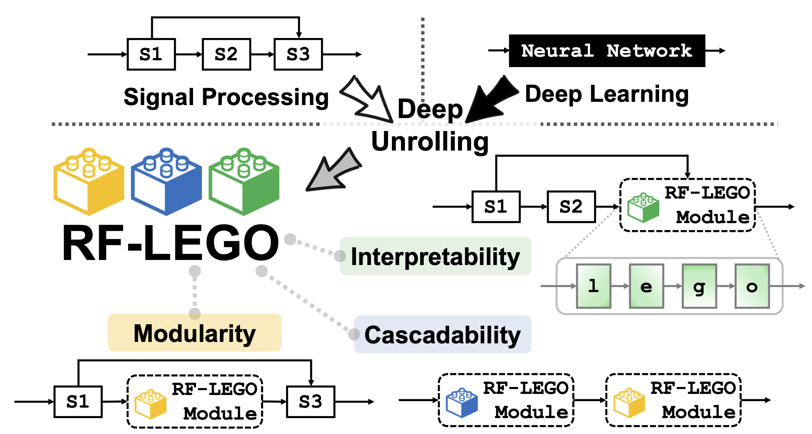

 

# RF-LEGO:  Modularized Signal Processing-Deep Learning Co-Design for RF Sensing via Deep Unrolling

---

## Abstract
Wireless sensing, traditionally relying on signal processing (SP) techniques, has recently shifted toward data-driven deep learning (DL) to achieve performance breakthroughs. However, existing deep wireless sensing models are typically end-to-end and task-specific, lacking interpretability and reusability. We propose RF-LEGO, a modular co-design framework that transforms interpretable SP algorithms into trainable, physics-grounded DL modules through deep unrolling. By replacing hand-tuned parameters with learnable ones while preserving core processing structures and mathematical operators, RF-LEGO ensures modularity, cascadability, and block-level interpretability. Specifically, we introduce three deep-unrolled modules for critical RF sensing tasks: frequency transform, spatial angle estimation, and signal detection. Extensive experiments using self-collected and public datasets, including millimeter-wave, UWB, and Wi-Fi sensing, demonstrate that RF-LEGO significantly outperforms existing SP and DL baselines, both standalone and when integrated into downstream tasks such as tracking and vital sign monitoring. RF-LEGO pioneers a novel SP-DL co-design paradigm for wireless sensing via deep unrolling, paving the way for efficient and interpretable deep wireless sensing solutions.

  

